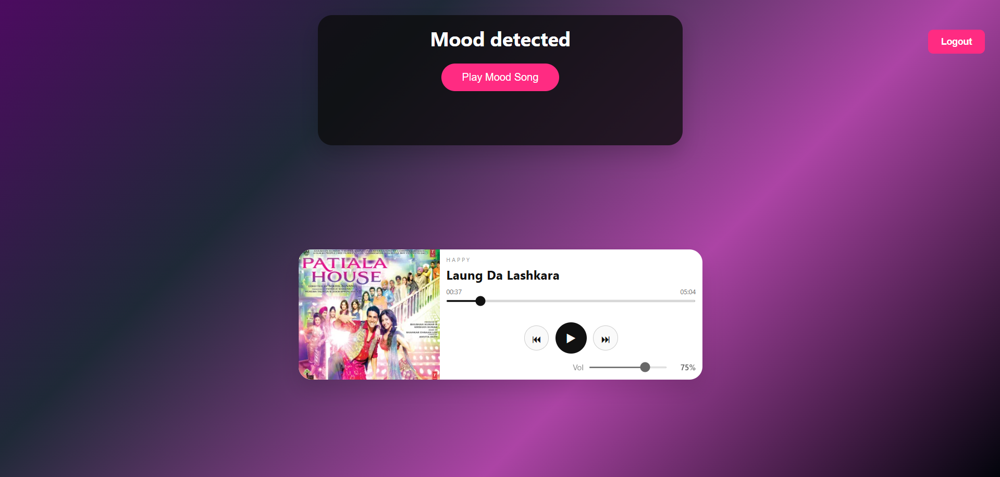
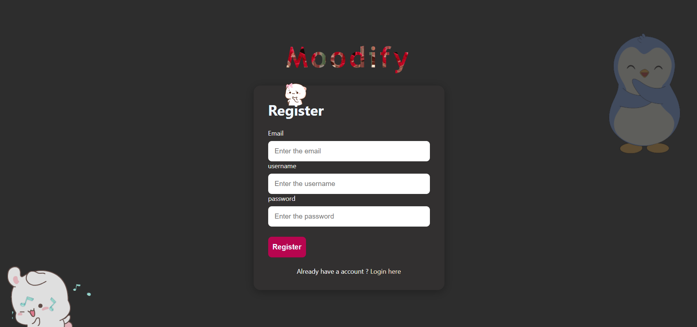

# 🎧 Moodify

### *Your Mood. Your Music. Your Space.*

<div align="center">



### A premium AI-powered mood based music experience built with MERN Stack.

Live Demo → [https://moodify-front-dhuh.onrender.com/login](https://moodify-front-dhuh.onrender.com/login)

</div>

---

# ✨ What is Moodify?

Moodify is not just a music app.
It is an intelligent emotion-driven experience that understands your mood and creates an immersive vibe around it.

From facial mood detection to dynamic music recommendations and smooth real-time interactions — Moodify combines AI + modern web technologies into one premium platform.

Whether you're happy, sad, energetic, relaxed, or emotional — Moodify adapts to *you.*

---

# 🖼️ Preview

## Authentication Experience



---

## Feed & Music Experience


---

# 🚀 Core Features

## 🎭 AI Mood Detection

* Detects user emotions intelligently
* Personalized experience based on mood
* Dynamic music vibe generation
* Emotion-first user interaction

---

## 🎵 Smart Music Feed

* Beautiful responsive music feed
* Smooth UI interactions
* Premium dark aesthetic
* Dynamic cards & mood themes
* Personalized content flow

---

## 🔐 Advanced Authentication System

* JWT Authentication
* Secure Token Handling
* Token Blacklisting
* Google Authentication
* Protected Routes
* Session Security

---

## ⚡ Performance Focused

* Redis caching integration
* Optimized backend architecture
* Fast API responses
* Scalable MERN setup
* Clean component structure

---

## 🎬 Media Pipeline

* Media processing flow
* Structured content handling
* Optimized asset delivery
* Smooth user experience

---

# 🛠️ Tech Stack

<div align="center">

| Frontend     | Backend    | Database      | Authentication     | Performance    |
| ------------ | ---------- | ------------- | ------------------ | -------------- |
| React.js     | Node.js    | MongoDB       | JWT + Google OAuth | Redis          |
| Tailwind CSS | Express.js | Mongoose      | Token Blacklist    | Caching        |
| React Router | REST APIs  | Cloud Storage | Secure Sessions    | Optimized APIs |

</div>

---

# 🧠 Architecture Highlights

```bash
Frontend (React)
      ↓
REST APIs
      ↓
Node + Express Backend
      ↓
Authentication Layer
(JWT + Google OAuth + Token Blacklist)
      ↓
Redis Cache Layer
      ↓
MongoDB Database
```

---

# 🌌 Experience Philosophy

Moodify was designed to feel:

* Minimal
* Cinematic
* Emotional
* Intelligent
* Smooth
* Premium

Every interaction is built to create a modern streaming platform vibe.

---

# 💡 Why Moodify Stands Out

Most music apps only play songs.

Moodify understands the user first.

It combines:

* Emotion Detection
* Smart Recommendation Logic
* Modern UI/UX
* Secure Authentication
* Real-time Performance
* AI-inspired interactions

into one seamless experience.

---

# 📂 Project Structure

```bash
Moodify/
│
├── Frontend/
│   ├── Components/
│   ├── Pages/
│   ├── Context/
│   ├── Hooks/
│   └── Services/
│
├── Backend/
│   ├── Controllers/
│   ├── Models/
│   ├── Routes/
│   ├── Middleware/
│   ├── Redis/
│   └── Authentication/
│
└── Screenshots/
```

---

# 🎯 Future Vision

* AI Playlist Generation
* Real-time Mood Tracking
* Voice Emotion Detection
* Smart Recommendation Engine
* Spotify Integration
* Advanced Analytics
* Social Music Sharing

---

# 👨‍💻 Developer

Built with passion by:

## Notanormaldev

Focused on building immersive, scalable, and modern web experiences.

---

# ⭐ Support

If you like this project:

* Star the repository ⭐
* Share the project 🚀
* Fork and improve it 🔥

---

<div align="center">

# 🎶 Moodify

### *Feel the Music. Feel Yourself.*

</div>
